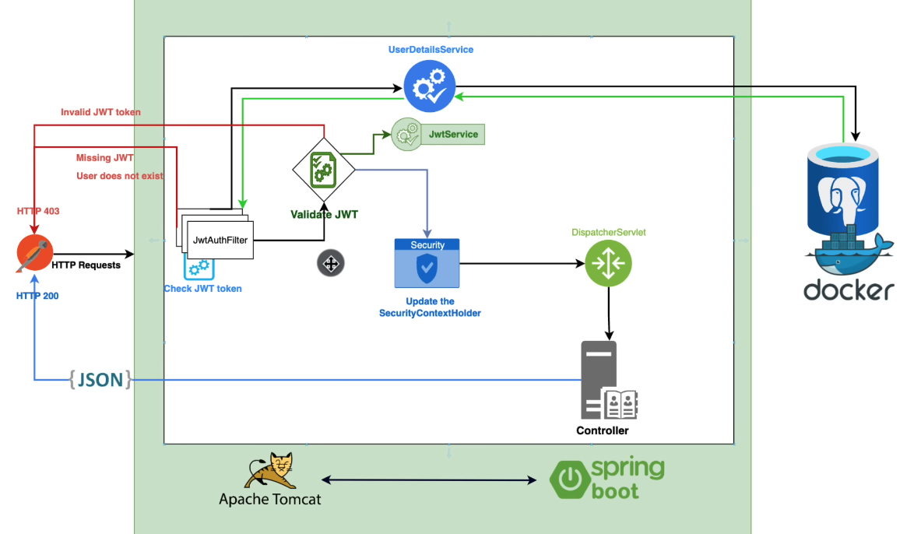

# Spring Security con JWT 

[Spring Boot 3 + Spring Security 6 - JWT Authentication and Authorisation](https://www.youtube.com/watch?v=KxqlJblhzfI&lc=UgxR_eyB7RsTb6CxA7B4AaABAg)

Este proyecto se hizo con la finalidad de aprender el módulo de seguridad Spring Security y como trabaja con JWT, el cual es una tecnologia
que permite transferir datos de manera segura ya que incluye una firma que garantiza la integridad de este token.

Para la **base de datos** se trabajo con SQL Server.

